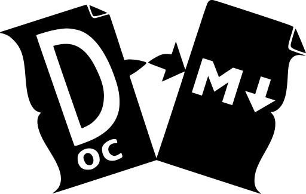

# Office To Markdown 

A collection of Python scripts to transform folders of content in common Office formats (DOCX, PPTX, etc), image formats (JPG, PNG, SVG, etc) or video formats (MP4, MOV, etc) into websites, slideshows and so on.

Output is generally in structured Markdown designed to be used as the input for the [Hugo](https://gohugo.io/) static site generation tool, letting users choose their own Hugo site templates.

The "scanFolders.py" Python script acts as an overall starting point, triggering other sub-scripts to run conversions on a folder tree containing various content. Each sub-script should also be able to be used as a stand-alone application for those wanting more custom workflows.

## Quickstart
Download / clone the Git repository. These scripts are written in Python 3 and, as such, should be cross-platform. On Linux, there's a Bash script that will set up and activate a Python venv to run the script:

```
bash scanFolders.sh --input ~/Documents/www --output ~/.cache/Hugo --verbose
```

## Requirements
There's a Python requirements.txt file that should be installed into a Python venv (handled by the helper Bash script above if you use that).

The scripts used for each item might have further individual requirements, including supporting applications (such as Slideshows using LibreOffice for some document conversions and ffmpeg to handle videos), see the relevant script's documentation for details.

## Cloud-Based Filesystems
The scripts are intended to be run over a simple folder tree. They should work with pretty much anything that looks to the operating system like a local tree of folders, so if you have a utility that maps a cloud-based file system of some kind to a local path (the official Google Drive / OneDrive / Dropbox clients on Windows, for instance) you should be able to run the scripts on that path (both as input or output location) in the same way. In this way, you can set up a content publishing pipeline that allows your users to edit content directly in their usual Office editor (desktop Microsoft Word, Office 365 Word, Google Docs, Libre Office, etc) and publish directly to a website.

If you're on a Linux or MacOS system (or, actually, Windows), we can recommend [rclone](https://rclone.org/) as being an excellent way of mounting / cloning over 50 cloud provider's filesystems as a local filesystem.

## Usage
You are probably best off running the scanFolders.sh script, which sets up the Python environment (venv and environment settings variables) before passing any arguments to the scanFolders.py script.

`scanFolders.py [-h] [--input INPUT] [--output OUTPUT] [--scriptRoot SCRIPTROOT] [--dataRoot DATAROOT] [--verbose] [--copyIn SRC DEST] [--deleteExtraFiles] [--dryRunExtraFiles]`

| Option                    | Action                                                                                                                |
|---------------------------|-----------------------------------------------------------------------------------------------------------------------|
| `-h, --help`              | Show this help message and exit.                                                                                      |
| `--input INPUT`           | Input folder.                                                                                                         |
| `--output OUTPUT`         | Output folder.                                                                                                        |
| `--scriptRoot SCRIPTROOT` | The root of the script folder. Defaults to the current working directory.                                             |
| `--dataRoot DATAROOT`     | The root of the script folder. Defaults to the current working directory.                                             |
| `--verbose`               | Turn on verbose output.                                                                                               |
| `--copyIn SRC DEST`       | Copy in the contents of the given folder (SRC) to the given output folder (DEST), relative to the root output folder. |
| `--deleteExtraFiles`      | Remove any extra files from the output folder not egnerated by this script.                                           |
| `--dryRunExtraFiles`      | Does a dry-run of the deleteExtraFiles option, just displaying which files would be deleted by this action.           |

## The Transform Sub-Scripts
- [FAQ](FAQ/processFAQ.md)
- [Slideshow](slideshow/processSlideshow.md)

## Extending
If you want to extend the functionality of this project, you'll need to write a command-line script / application that accepts a defined set of parameters at the command line and that reads in a set of data via STDIN and writes out modifications to STDOUT. There is a docsToMarkdownLib Python library that contains most of the functionality you'll need if you are writing a script in Python, but really you can write a command line application in any language you prefer. You can find more details, whether for yourself or for an AI agent, in the [AGENTS](AGENTS.md) file.

## Related Projects
The transform scripts should all work from the command line, but as an added feature they might be used with the [Web Console](https://github.com/dhicks6345789/web-console) project to produce a very simple front end. Therefore, when writing additional scripts it would be best to include formatting in any output (progress / error messages, progress bars, etc) suitable for Web Console to use - see the project's page for more details.

If you are a systems administrator wanting a sandboxed development environment for your users, complete with a web-publishing pipeline that enables simple editing inside common Office tools and publication to the public or access-controlled web, then look at our [Per-User Web Server](https://github.com/dhicks6345789/per-user-web-server) project, which can turn a basic Debian server into a full multi-user, cloud-integrated development and web publishing environment suitable for corporate and educational environments.
